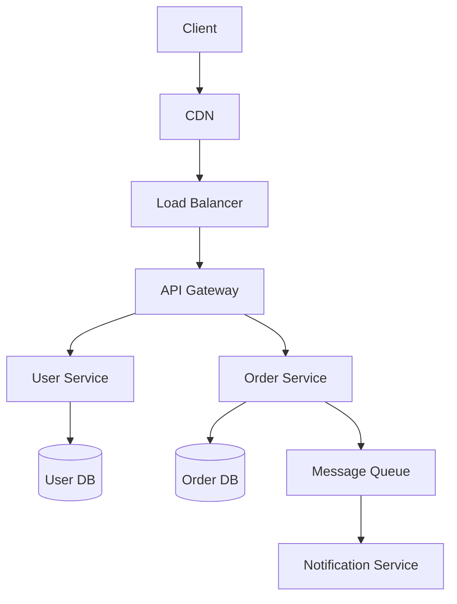

# Whiteboarding Guide — How to Ace Architecture Sessions

---

## 🟢 Plain English Summary — Read This First

### What is this document about?
The Swiss Re final round will include a whiteboarding session where you design a system on a whiteboard while the interviewer watches. This document tells you exactly what to do, what to say, what to draw, and how to handle tough questions.

The most important thing: **never start drawing immediately**. Always spend 3-5 minutes asking clarifying questions first. This is what separates architects from developers.

---

### Key Concepts Explained

**Why whiteboarding matters:**
The interviewer isn't just checking if you know the right answer. They're watching HOW you think. Do you ask the right questions? Do you acknowledge trade-offs? Can you handle ambiguity? Can you communicate clearly while drawing?

**The architect mindset on the whiteboard:**
- You drive the conversation (you're the expert)
- You ask questions before drawing (shows maturity)
- You make decisions and explain why (shows confidence)
- You acknowledge what you don't know (shows honesty)
- You handle challenges gracefully (shows resilience)

---

### The 5-Step Framework in Plain English

**Step 1 — Clarify Requirements (3-5 minutes):**
Say: "Before I start designing, let me ask a few clarifying questions."

Ask about:
- Scale: "How many users? How many requests per second?"
- Availability: "What's the SLA? Can we afford 1 hour of downtime per month?"
- Latency: "What's the acceptable response time? Under 200ms?"
- Consistency: "Is eventual consistency acceptable, or do we need strong consistency?"
- Geography: "Single region or global?"
- Compliance: "Any regulatory requirements? GDPR? PCI?"

**Step 2 — Estimate Scale (2-3 minutes):**
Say: "Let me do a quick back-of-envelope calculation."

Example: "10 million daily users × 10 requests/day = 100 million requests/day = ~1,200 requests/second average, ~3,600 at peak."

This shows you understand scale and can do quick math.

**Step 3 — High-Level Design (5-7 minutes):**
Draw the big boxes first. Don't go deep yet.
- Client (web/mobile)
- CDN/Edge
- Load Balancer
- Core Services (2-4 boxes)
- Databases
- Cache
- Message Queue (if needed)

Label every arrow with what data flows and which protocol.

**Step 4 — Deep Dive (10-15 minutes):**
The interviewer will guide you. Or proactively say: "The most interesting part is [X]. Let me explain how it works."

**Step 5 — Trade-offs and Bottlenecks (3-5 minutes):**
Say: "Let me walk through the trade-offs and potential bottlenecks."

Identify 2-3 bottlenecks and propose solutions.

---

### Magic Phrases to Use

**Opening:**
- "Before I start, let me clarify a few requirements..."
- "Let me do a quick estimation to understand the scale..."

**While drawing:**
- "I'm drawing the happy path first, then we'll add resilience..."
- "This arrow represents an async call via message queue — I'll explain why..."

**Making decisions:**
- "I'm choosing X because [reason]. The trade-off is [downside], which we mitigate by [solution]."

**Handling uncertainty:**
- "I'm not 100% sure of the exact limits here, but the approach would be..."
- "Good question — let me think through that..." (pause, think, answer)

**When challenged:**
- "That's a great point, let me reconsider..."
- "You're right — if [condition], I'd change this to [alternative]."

---

### Common Mistakes to Avoid

1. Starting to draw immediately (always clarify first)
2. Drawing too detailed too fast (start high-level)
3. Not explaining while drawing (narrate everything)
4. Ignoring non-functional requirements (always address scale, availability, security)
5. Presenting only one option (always mention alternatives)
6. Getting defensive when challenged
7. Saying "I don't know" (say "I'd approach it by..." instead)
8. Forgetting failure modes (what happens when [component] fails?)
9. Not mentioning monitoring/observability
10. Drawing a "perfect" system (acknowledge trade-offs — real systems always have them)

---

### Swiss Re Specific — Likely Whiteboard Problems

Based on the role (Shared Services, Azure + Alibaba Cloud):

1. **Design a Shared Database Service** — How do multiple teams self-service provision databases with governance?
2. **Design a Multi-Cloud Data Platform** — Azure (Europe) + Alibaba (Asia) with data residency requirements
3. **Microservices Migration** — How do you migrate a monolith to microservices without downtime?

For each, use the 5-step framework. Start with requirements. Estimate scale. Draw high-level. Deep dive. Trade-offs.

---

> Swiss Re final round will have a whiteboarding session. This guide tells you exactly what to do, say, and draw.

---

## 1. The Whiteboard Mindset

### You are the architect, not the student
- You drive the conversation
- You ask clarifying questions
- You make decisions and explain why
- You acknowledge trade-offs proactively
- You handle ambiguity confidently

### What they are evaluating
1. Can you structure your thinking under pressure?
2. Do you ask the right questions?
3. Can you make decisions with incomplete information?
4. Do you understand trade-offs?
5. Can you communicate clearly while drawing?

### The Golden Rule
**Never start drawing immediately.** Always spend 3-5 minutes on requirements first. This shows maturity.

---

## 2. The 5-Step Whiteboard Framework

### Step 1: Clarify Requirements (3-5 min)
Say: *"Before I start designing, let me ask a few clarifying questions."*

Ask about:
```
Functional:
  - What are the core features? (don't gold-plate)
  - What are the user types?
  - What are the key workflows?

Scale:
  - How many users? DAU?
  - Expected requests per second?
  - Data volume?
  - Growth rate?

Non-functional:
  - Availability SLA? (99.9%? 99.99%?)
  - Latency requirements? (P99 < 200ms?)
  - Consistency requirements? (strong or eventual?)
  - Geographic distribution? (single region or global?)

Constraints:
  - Cloud provider? (Azure, AWS, Alibaba?)
  - Compliance requirements? (GDPR, PCI, HIPAA?)
  - Budget constraints?
  - Existing systems to integrate with?
```

### Step 2: Estimate Scale (2-3 min)
Say: *"Let me do a quick back-of-envelope to understand the scale."*

```
Example for 10M DAU:
  Requests: 10M * 10 req/day = 100M/day = ~1200 req/sec (avg)
  Peak: 3x average = ~3600 req/sec
  Storage: 10M users * 1KB profile = 10GB user data
  DB: 1200 writes/sec → need sharding or NoSQL
```

### Step 3: High-Level Design (5-7 min)
Say: *"Let me draw the high-level architecture first, then we can deep dive."*

Draw these boxes in order:
```
1. Client (web/mobile)
2. CDN / Edge (if needed)
3. Load Balancer / API Gateway
4. Core Services (2-4 boxes)
5. Databases
6. Cache
7. Message Queue (if async needed)
8. External integrations
```

**Draw arrows and label them** — show data flow direction.

### Step 4: Deep Dive (10-15 min)
Say: *"Which component would you like me to deep dive on?"*

Or proactively: *"The most interesting part of this design is [X]. Let me explain how it works."*

Common deep dives:
- Database schema and choice
- Caching strategy
- How you handle failures
- How you scale the bottleneck
- Security model

### Step 5: Trade-offs & Bottlenecks (3-5 min)
Say: *"Let me walk through the trade-offs and potential bottlenecks."*

```
"The main bottleneck here is the database write path. At 3600 req/sec,
a single PostgreSQL instance will struggle. We can address this by:
1. Read replicas for read traffic
2. Connection pooling (PgBouncer)
3. Caching frequently read data in Redis
4. If writes become the bottleneck, we can shard by customer ID"
```

---

## 3. Diagram Drawing Techniques

### What to Draw First
```
1. Boundary box (system boundary)
2. External actors (users, external systems)
3. Entry point (LB, API Gateway)
4. Core services
5. Data stores
6. Arrows with labels
```

### Symbols to Use
```
Rectangle: service, component, system
Cylinder: database
Cloud shape: external service / internet
Diamond: decision point
Arrow: data flow (label with: what data, which protocol)
Dashed box: logical grouping (AZ, region, VNet)
```

### Color Coding (if markers available)
```
Blue: services / compute
Green: databases / storage
Red: security components (WAF, firewall)
Orange: messaging / queues
Yellow: external systems
```

### Layered Drawing Approach
```
Layer 1: Draw the happy path (normal flow)
Layer 2: Add redundancy (multiple AZs, replicas)
Layer 3: Add cross-cutting concerns (monitoring, security)
Layer 4: Add failure handling (circuit breakers, DLQ)
```

---

## 4. Diagram Tools (for preparation)

### For Whiteboard Practice
- **Excalidraw** (excalidraw.com): free, hand-drawn style, great for whiteboard simulation
- **draw.io / diagrams.net**: free, professional, many shapes
- **Miro**: collaborative whiteboard, good for remote interviews
- **Lucidchart**: professional, AWS/Azure shape libraries

### For Documentation
- **PlantUML**: text-based diagrams (good for version control)
- **Mermaid**: markdown-embedded diagrams
- **C4 Model tools**: Structurizr

### ASCII Diagrams (for text-based communication)
```
Use these characters:
  ─ │ ┌ ┐ └ ┘ ├ ┤ ┬ ┴ ┼  (box drawing)
  → ← ↑ ↓ ↔ ↕  (arrows)
  [ ] ( ) { }  (boxes)
```

### Mermaid Diagram Example


---

## 5. Whiteboard Phrases That Show Architect Thinking

### Opening
- *"Before I start, let me clarify a few requirements..."*
- *"Let me do a quick estimation to understand the scale..."*
- *"I'll start with the high-level design, then we can deep dive into specific components."*

### While Drawing
- *"I'm drawing the happy path first, then we'll add resilience..."*
- *"This arrow represents an async call via message queue — I'll explain why in a moment..."*
- *"I'm grouping these in the same AZ for low latency..."*

### Making Decisions
- *"I'm choosing DynamoDB here because our access pattern is simple key lookups at high throughput. The trade-off is we lose complex query capability, which is acceptable for this use case."*
- *"I'd use eventual consistency here — the business requirement doesn't need real-time accuracy, and eventual consistency gives us much better availability."*
- *"There are two approaches here: [A] and [B]. I'd recommend [A] because [reason], though [B] would be better if [condition]."*

### Handling Uncertainty
- *"I'm not 100% sure of the exact limits here, but the approach would be..."*
- *"This is an area where I'd want to validate with a proof of concept, but architecturally..."*
- *"Good question — let me think through that..."* (pause, think, answer)

### Showing Trade-offs
- *"The trade-off here is [consistency vs availability / cost vs performance / simplicity vs scalability]..."*
- *"This approach works well for [scenario] but would struggle with [edge case]. We'd mitigate that by..."*
- *"I'm making this decision based on the requirements you gave me. If [requirement changes], I'd reconsider..."*

---

## 6. Swiss Re Specific Preparation

### Expected Topics
Based on the role (Shared Services, Azure + Alibaba):

1. **Shared Database Service Design** (see file 19)
2. **Azure Governance** (see file 17) — your gap area
3. **Multi-cloud architecture** (Azure + Alibaba)
4. **Microservices patterns** (Saga, CQRS, Circuit Breaker)
5. **Java architecture** (design patterns, Spring Boot)

### Likely Whiteboard Problems

**Problem 1: Design a Shared Database Service**
```
Approach:
1. Requirements: who uses it? what DBs? self-service? compliance?
2. Draw: provisioning layer, access management, monitoring, cost allocation
3. Deep dive: how teams request DBs (Terraform module / portal)
4. Governance: tagging, private endpoints, managed identity, audit
5. Trade-offs: standardization vs flexibility
```

**Problem 2: Design a Multi-Cloud Data Platform (Azure + Alibaba)**
```
Approach:
1. Requirements: data types, latency, compliance, team locations
2. Draw: Azure region (Europe), Alibaba region (Asia), connectivity
3. Data flow: where does data originate? where is it consumed?
4. Governance: consistent policies across clouds
5. Trade-offs: data residency, latency, cost
```

**Problem 3: Microservices Migration**
```
Approach:
1. Requirements: current state (monolith), target state, timeline
2. Draw: strangler fig pattern
3. Deep dive: how to extract first service
4. Data migration: dual-write, CDC
5. Trade-offs: risk vs speed
```

---

## 7. Handling Tough Questions

### "What would you do differently?"
*"Looking back at this design, I'd consider [X] as an alternative. The reason I didn't go with it initially is [Y], but if [condition], it would be worth revisiting."*

### "How would this scale to 10x?"
*"At 10x scale, the bottleneck would be [component]. I'd address that by [solution]. The rest of the architecture would scale horizontally without major changes."*

### "What's the weakest part of this design?"
*"The weakest part is [honest answer]. It's a known trade-off — we accepted it because [reason]. To strengthen it, we could [improvement], but that would add [cost/complexity]."*

### "How would you handle a database failure?"
*"We have [primary + standby / multi-AZ / geo-replication]. Automatic failover kicks in within [RTO]. During failover, [what happens to in-flight requests]. We test this quarterly with chaos engineering."*

### "What about security?"
*"Security is layered: at the network level [VNet, NSG, Private Endpoints], at the identity level [Managed Identity, no passwords], at the data level [encryption at rest with CMK, TLS in transit], and at the audit level [all access logged to Log Analytics]."*

---

## 8. 30-Minute Whiteboard Session Structure

```
0:00 - 0:05  Requirements clarification
  - Ask 5-7 targeted questions
  - Write key requirements on the board

0:05 - 0:08  Estimation
  - Quick scale calculation
  - Identify if it's read-heavy, write-heavy, or balanced

0:08 - 0:18  High-level design
  - Draw all major components
  - Explain each component as you draw
  - Show data flow with arrows

0:18 - 0:25  Deep dive
  - Pick the most interesting/complex component
  - Or follow interviewer's direction
  - Show internal design

0:25 - 0:28  Trade-offs and bottlenecks
  - Identify 2-3 bottlenecks
  - Propose solutions

0:28 - 0:30  Summary
  - "To summarize, the key design decisions were..."
  - "The main trade-offs are..."
  - "If I had more time, I'd also consider..."
```

---

## 9. Common Mistakes to Avoid

1. **Starting to draw immediately** — always clarify requirements first
2. **Drawing too detailed too fast** — start high-level, go deep only when asked
3. **Not explaining while drawing** — narrate everything you draw
4. **Ignoring non-functional requirements** — always address scale, availability, security
5. **Presenting only one option** — always mention alternatives and why you chose this one
6. **Getting defensive when challenged** — "That's a great point, let me reconsider..."
7. **Saying "I don't know"** — say "I'd approach it by..." or "My instinct is X, but I'd validate with..."
8. **Forgetting failure modes** — always address: what happens when [component] fails?
9. **Not mentioning monitoring** — always add observability to your design
10. **Drawing a perfect system** — acknowledge trade-offs, show you understand real-world constraints

---

## 10. Quick Reference: Architecture Decisions

| Scenario | Decision | Reason |
|----------|----------|--------|
| High read throughput | Redis cache + read replicas | Reduce DB load |
| High write throughput | Sharding or NoSQL | Distribute writes |
| Real-time updates | WebSocket or SSE | Bidirectional or server push |
| Async processing | Message queue (SQS/Service Bus) | Decouple, retry |
| Global users | CDN + multi-region | Reduce latency |
| Compliance data | Private endpoints + CMK | No public access, customer control |
| Service-to-service auth | mTLS via Istio | No passwords, mutual verification |
| Distributed transaction | Saga pattern | No 2PC, compensating transactions |
| Read/write different scale | CQRS | Separate optimization |
| Monolith migration | Strangler fig | Incremental, low risk |
| Unknown traffic pattern | Auto-scaling + serverless | Pay for use, handle spikes |
| Sensitive secrets | Key Vault + Managed Identity | No credentials in code |
